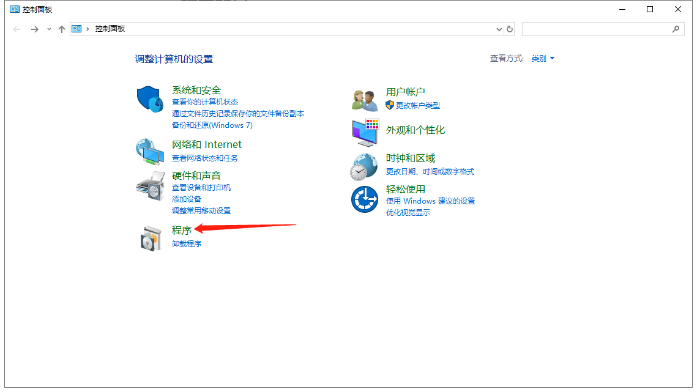
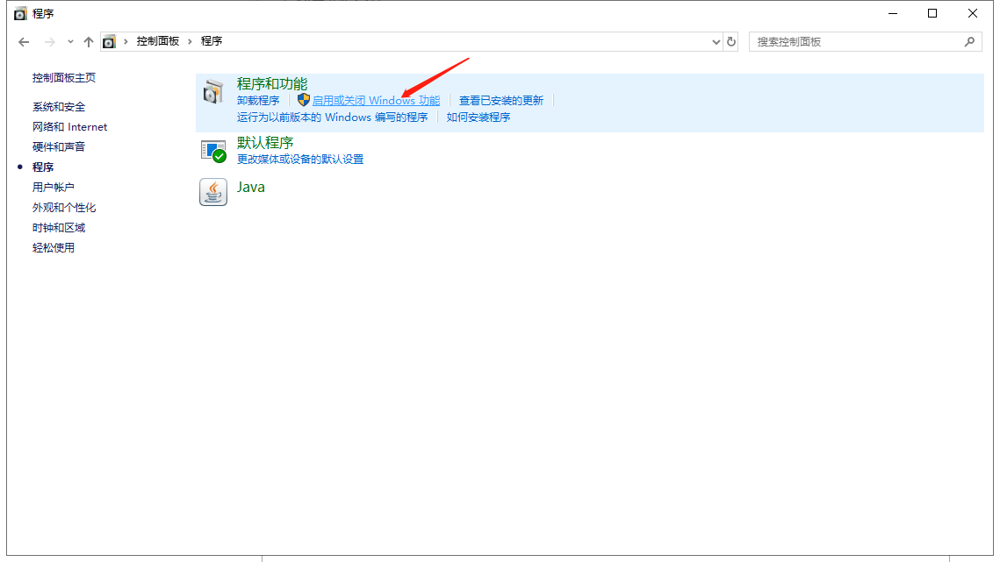
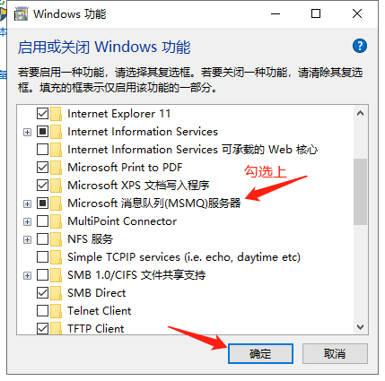
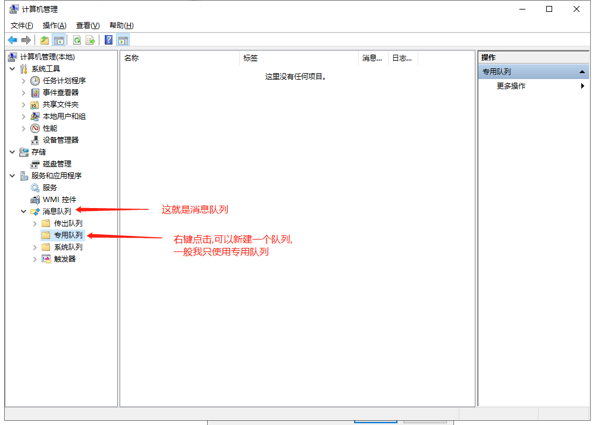
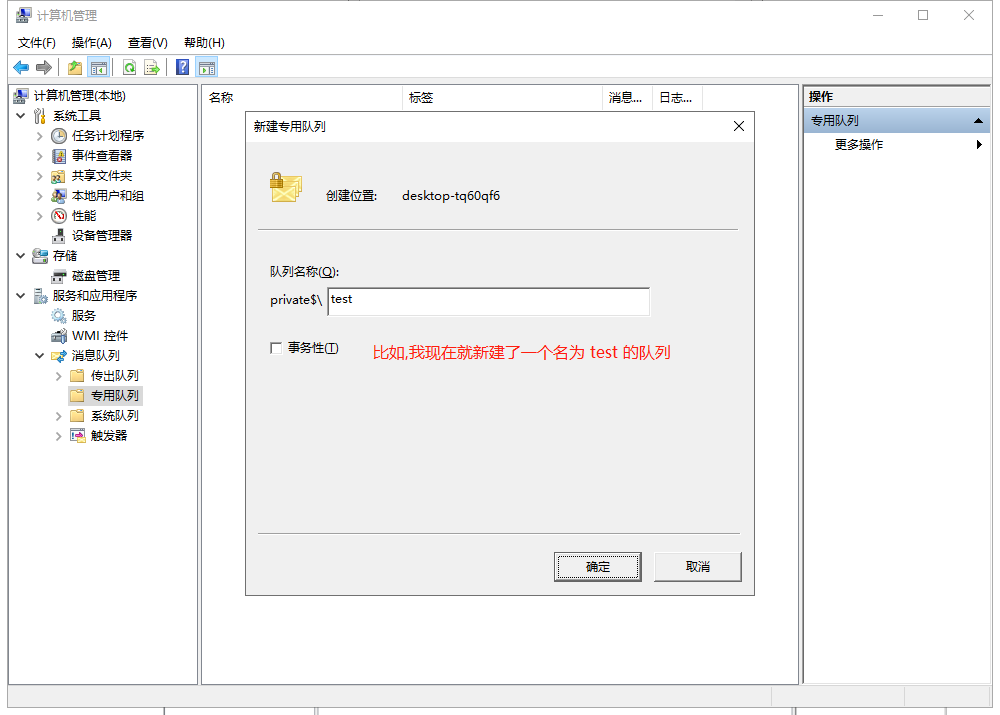
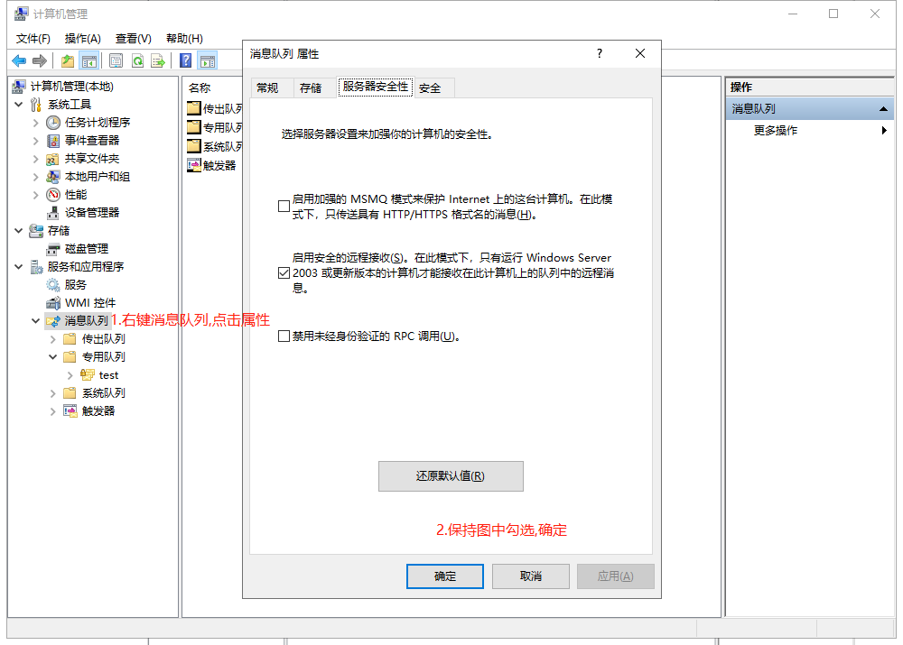
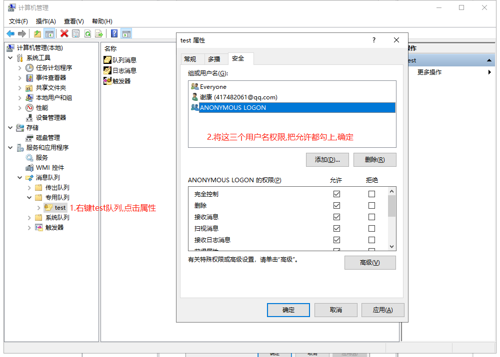
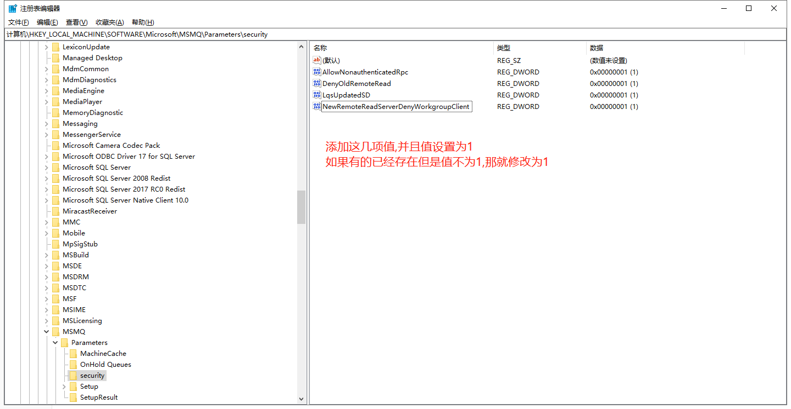

# Spring-boot-MSMQ-Demo
在win10环境下用Spring boot构建一个可以与MSMQ（微软消息队列）连接的Demo

## 研究背景:

某天，我们的项目需要和第三方对接数据，并且用到的是之前基本没有听说过的MSMQ（微软消息队列）。

然后，我就负责来研究这个用java来实现连接MSMQ。

这期间，踩了一些坑，特此记录自己的研究历程。

## 开发环境：

> win10专业版64位

`windows server 2016 64位`也试过可以运行，并且也没有将开发的程序部署在Linux上

> jdk-8u101-windows-x64

**这是大坑点！！！jdk的版本最好保持如上述一致，因为会存在某些jdk版本下，即使都是java1.8，如果小版本不对，也会在在最后项目启动时抛出找不到dll依赖的异常。**

## MSMQ安装与配置







然后右键我的电脑，点击管理，计入计算机管理窗口









最后打开windows的注册表，打开HKEY_LOCAL_MACHINE\SOFTWARE\Microsoft\MSMQ\Parameters\security路径。



| 名称                                   | 值   |
| -------------------------------------- | ---- |
| AllowNonauthenticatedRpc               | 1    |
| DenyOldRemoteRead                      | 1    |
| LqsUpdatedSD                           | 1    |
| NewRemoteReadServerDenyWorkgroupClient | 1    |

至此，关于MSMQ的安装配置结束。

## 开发环境配置

### jdk版本

再次强调，最好保持版本与文档开头说明的一致。

### 依赖jar包

可能用Java来连接MSMQ的需求很少，所以我并没有找到直接粘贴在pom文件中的可用依赖。

所以，你应该通过你使用的IDE来引用libs中的`MsmqJava.jar`。

当然了，你也可以在项目根目录下执行`mvn clean`，这样就会自动把`MsmqJava.jar`加载到你项目本地的maven仓库中，具体实现可以看pom文件。

### dll依赖

项目中的dll文件夹中的`MsmqJava.dll`文件务必复制到‪C:\Windows\System32路径中，这是为了`MsmqJava.jar`

中的方法能够读取到这个文件。

## 代码编写

### applicaltion.yml

```yaml
msmq:
  queue:
	# 格式为:direct=tcp:{ip}\private$\{队列名}
    url: direct=tcp:172.26.1.131\private$\test

```


### 创建一个队列

```java

/**
 * @author hariyoo
 * @Date 2020/4/1 18:03
 */
@Component
public class MsmqQueue {

	private static String fullName;

	private volatile static Queue queue;

	private MsmqQueue(){}

	public static Queue getInstance(){
		if (queue == null) {
			synchronized (Queue.class) {
				if (queue == null) {
					try {
						queue = new Queue(fullName);
					} catch (MessageQueueException e) {
						e.printStackTrace();
					}
				}
			}
		}
		return queue;
	}

  	// spring boot 给静态变量注入值的方式
	@Value("${msmq.queue.url}")
	public void setFullName(String url) {
		fullName = url;
	}
}
```

### 发送信息

```java
@Test
public void send(){
    try {
        Queue sendQueue = MsmqQueue.getInstance();
        String label = "test_send";
        String correlationId = "0";
        // 消息主体，你要发送的正文应该放在body里
        String body = "MSMQ真特么好用...!!??";
        Message msg= new Message(body, label, correlationId);
        sendQueue.send(msg);
        log.info("发送完成");
    } catch (UnsupportedEncodingException | MessageQueueException e) {
        e.printStackTrace();
    }
}
```

### 接收信息

```java
@Test
public void receive(){
    try {
        Queue queue = MsmqQueue.getInstance();
        Message message = queue.receive();
        String body = message.getBodyAsString();
        log.info("消息内容 -> {}", body);
    } catch (MessageQueueException | UnsupportedEncodingException e) {
        e.printStackTrace();
    }
}
```

## 总结

难点倒没有，坑点到是有。记录在此，希望有同样需求的小伙伴可以节省很多不必要的时间。